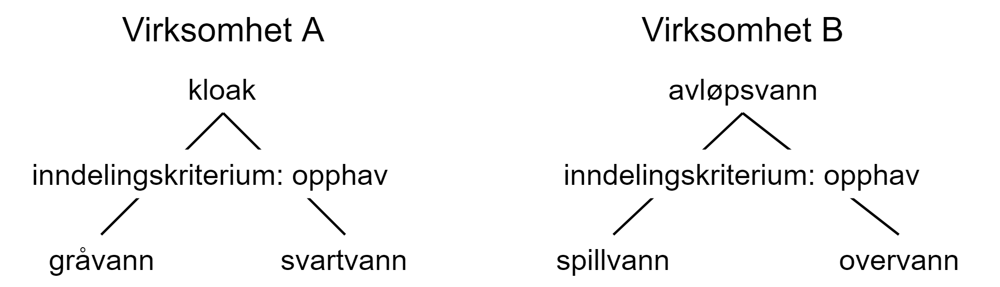
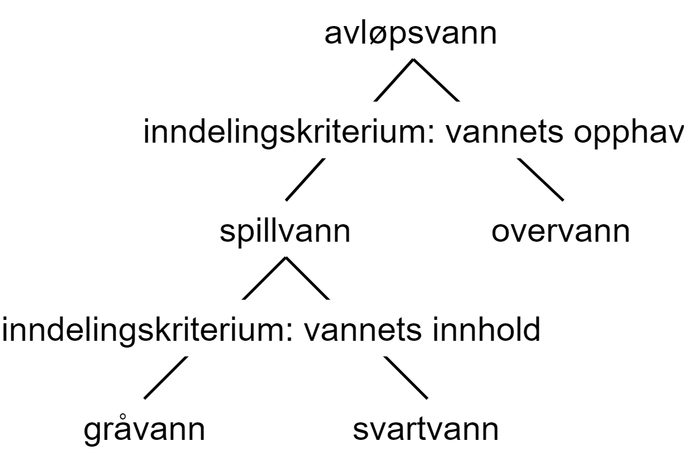
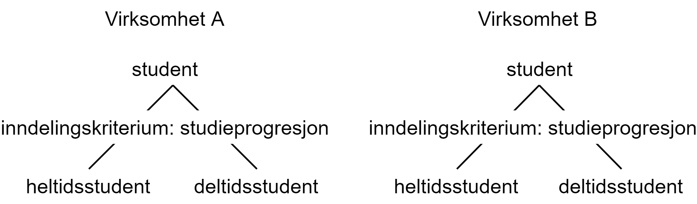

== Vedlegg B (informativt) - eksempler [[vedlegg-b]]

=== Oversikt over eksempler

I dette vedlegget finner du noen eksempler som viser hvordan standarden kan brukes. Selv om det er to virksomheter involvert i alle eksemplene, kan situasjonene som beskrives, gjerne være mellom flere enn to virksomheter, eller mellom to eller flere enheter i samme virksomhet.

Eksemplene baserer seg på nasjonale virksomheter, men framgangsmåtene kunne også gjelde mellom nasjonale og internasjonale virksomheter.

I <<eksempel1, det første eksemplet (‘kulturminne’)>> møter du to virksomheter som ønsker å *_harmonisere ett begrep_*. De gjør dette ved at den ene virksomheten tilpasser seg og bruker den andre virksomhetens termer og definisjoner.

I <<eksempel2, det andre eksemplet ('avløpsvann'/'kloakk')>> møter du virksomheter som ønsker å *_harmonisere to ulike sett av begreper_*. Det gjør de ved at de lager et nytt, felles begrepssystem som gir grunnlag for felles definisjoner og termer.

I <<eksempel3, det tredje eksemplet (‘gjennomføringsgrad’)>> møter du to virksomheter som ønsker å harmonisere ett begrep som de har definert ulikt. Det viser seg å ikke være mulig å harmonisere begrepet, og de ender opp med *_to differensierte begreper_*.

I <<eksempel4, det fjerde eksemplet (‘heltidsstudent’)>> møter du to virksomheter som ønsker å harmonisere ett begrep som de har definert ulikt. De finner ut at de må inkludere et sideordnet begrep i arbeidet. Harmoniseringsarbeidet viser seg å være urealistisk, og de ender opp med *_to sett av differensierte begreper_*.

=== Eksempler på begrepsharmonisering

==== Eksempel: ett harmonisert begrep som resultat [[eksempel1]]

*Hensikt*: Eksemplet illustrerer hvordan to virksomheter harmoniserer begreper ved at den ene bruker den andres definisjon og term.

*Utgangspunkt*: Kommune A ønsker å bruke begrepet ‘kulturminne’ i samsvar med andre, relevante virksomheter.

*Er omfanget avgrenset og begrepene definerte?* Ja, omfanget er avgrenset til kun begrepet ‘kulturminne’, og begrepet er definert, men de ulike virksomhetene har definert begrepet ulikt.

*Steg 1: Sammenstilling av begreper*

Kommune A finner at begrepet også er definert i kulturminneloven. Loven forvaltes av virksomhet B, som blir invitert til et møte.

Steg 1.1 Virksomhetene møtes og presenterer termene og definisjonene som skal harmoniseres eller differensieres.

Kommune A:
[cols="10s,90d"]
|===
|term|_kulturminne_
|definisjon|eldre spor av mennesker
|kilde|egendefinert
|===

Virksomhet B:
[cols="10s,90d"]
|===
|term|_kulturminne_
|definisjon|alle spor etter menneskelig virksomhet i vårt fysiske miljø, herunder lokaliteter det knytter seg historiske hendelser, tro eller tradisjon til
|kilde|Lov om kulturminner
|===

Steg 1.2 Virksomhetene undersøker andre kilder (Store norske leksikon, ordbøker, Felles begrepskatalog, Termportalen og termbasen Snorre) og finner en definisjon fra Store norske leksikon:

[cols="10s,90d"]
|===
|term|_kulturminne_
|definisjon|konkrete, som regel synbare, spor etter eldre tiders liv og virke
|kilde|Store norske leksikon
|===

Steg 1.3 Begrepsdiagrammer: uaktuelt fordi det er snakk om ett begrep.

Steg 1.4 Virksomhetene stiller opp termene og definisjonene med kilder ved siden av hverandre:
[cols="1s,1d,4,4"]

|===
||*kommune A*|*virksomhet B*|*Store norske leksikon*
|term|_kulturminne_|_kulturminne_|_kulturminne_ (synonym: _fornminne_)
|definisjon|eldre spor av mennesker|alle spor etter menneskelig virksomhet i vårt fysiske miljø, herunder lokaliteter det knytter seg historiske hendelser, tro eller tradisjon til |konkrete, som regel synbare, spor etter eldre tiders liv og virke
|===

Steg 1.5 Virksomhetene identifiserer likheter og ulikheter:

Begrepsdefinisjon:  +
Alle definisjonene tar utgangspunkt i det felles overbegrepet ‘spor’. I tillegg blir det i kommune As og virksomhet Bs definisjon eksplisitt uttrykt at begrepet omfatter spor av _mennesker_, mens det i Store norske leksikon ikke er like tydelig. Imidlertid kan ordet _virke_ i Store norske leksikons artikkel antyde den samme avgrensingen.

Det som skiller definisjonen fra hverandre, er tidsangivelsen. Kommune As og Store norske leksikons definisjon peker på ‘eldre spor’, mens virksomhet B ikke gjør en slik avgrensing i sin definisjon.

Termer:  +
Termene er identiske, men Store norske leksikon fører i tillegg opp synonymet _fornminne_.

*Steg 2: Valg mellom begrepsharmonisering eller begrepsdifferensiering*

Virksomhetene gjør en vurdering av mulighetene for begrepsharmonisering og begrepsdifferensiering i et felles dokument. De vurderer ut fra følgende moment:

Steg 2.1 Terminologiske vurderinger

* Begrepene tilhører det samme fagområdet
* De vesentlige kjennetegnene er nokså like, men med et vesentlig avvik: tidsangivelsen
* Termene er identiske

Basert på terminologiske vurderinger er det gode muligheter for harmonisering av begrepene.

Steg 2.2 Administrative vurderinger

* Virksomhets Bs definisjon er fastsatt i lov og vil derfor være svært vanskelig og kostnadskrevende å endre. Det foreligger ingen planer om revisjon av den aktuelle loven.
* Begge virksomhetene har tilgang til faglig og terminologisk kompetanse.
* Kommune A har myndighet til uformelt og uten formkrav å endre sin egen definisjon.
* Begge virksomhetene uttrykker et sterkt ønske om å harmonisere for at loven skal håndheves riktig.

Basert på administrative og økonomiske vurderinger er det gode muligheter for harmonisering av begrepene.

Steg 2.3 Konklusjon +
Begrepene kan harmoniseres.

*Steg 3: Begrepsharmonisering*

Kommune A og virksomhet B blir enige om at begge bruker virksomhet Bs definisjon fordi det er den mest autoritative og er i tråd med allmenn faglig forståelse av begrepet.

Virksomhet B tar kontakt med Store norske leksikon for å informere om avviket fra definisjonen i leksikonoppslaget.

*Steg 4*: Begrepsdifferensiering, uaktuelt

*Steg 5: Enighet om forvaltningsmodell*

Virksomhet B og kommune A blir enige om at virksomhet B fortsatt er den ansvarlige for å forvalte begrepet og forplikter seg til å informere kommune A om de planlegger å endre begrepet.

*Slutt*: Begrepene er harmoniserte.

==== Eksempel: et sett av harmoniserte begreper som resultat [[eksempel2]]

*Hensikt*: Eksemplet illustrerer hvordan to virksomheter samarbeider om to ulike sett begreper, som blir harmonisert ved å etablere et nytt, felles begrepssystem.

*Utgangspunkt*: To offentlige virksomheter som arbeider innen miljøområdet, virksomhet A og virksomhet B, ønsker å harmonisere delvis overlappende begrepssystemer for avløpsvann for å etablere en felles rapporteringsordning.

*Er omfanget avgrenset og begrepene definerte?* Ja, virksomhetene har avgrenset omfanget til type avløpsvann, og begrepene er allerede definerte.

*Steg 1: Sammenstilling av begreper*

Steg 1.1 Virksomhetene møtes og presenterer termene og definisjonene som skal harmoniseres eller differensieres.

Virksomhet A
[cols="20,60,20"]
|===
|*term* | *definisjon* | *kilde*
|_avløpsvann_|vann som slippes ut fra husholdninger|egendefinert
|_gråvann_|avløpsvann fra husholdningers bad og dusjer, håndvasker og kjøkkenkummer|egendefinert
|_svartvann_|avløpsvann fra husholdningers toaletter|egendefinert
|===

Virksomhet B
[cols="20,60,20"]
|===
|*term* | *definisjon* | *kilde*
|_kloakk_|vann som slippes ut fra husholdninger eller i en industriprosess samt vann som ledes bort fra tak på bygninger, fra overflate av anlegg eller terreng|NS-EN 1085:1997: Rensing av avløpsvann - Ordliste
|_spillvann_|brukt vann som slippes ut etter bruk i husholdninger, industri og næringsbygg|egendefinert
|_overvann_|vann fra naturlig nedbør som ikke har blitt forurenset ved bruk|egendefinert
|===

Steg 1.2 Virksomhetene sjekker andre kilder for relevante termer og definisjoner: Lovdata, termbasen Snorre, Store norske leksikon, Felles begrepskatalog og Termportalen.

I termbasen Snorre finner virksomhetene følgende definisjoner som virksomhetene ønsker å ta med seg videre i arbeidet:

[cols="20,60,20"]
|===
|*term* | *definisjon* | *kilde*
|_avløpsvann_|vann som slippes ut fra husholdninger eller i en industriprosess samt vann som ledes bort fra tak på bygninger, fra overflate av anlegg eller terreng|NS-EN 1085:1997: Rensing av avløpsvann - Ordliste
|_spillvann_|brukt vann som hovedsakelig slippes ut fra vannklosett, dusj, badekar, bidé, håndvask, utslagsvask og gulvsluk|NS-EN 12056-5:2000: Avløpssystemer med selvfall i bygninger
|_overvann_|vann fra naturlig nedbør som ikke har blitt forurenset ved bruk|NS-EN 12056-5:2000: Avløpssystemer med selvfall i bygninger
|_gråvann_|spillvann som ikke inneholder fekale stoffer eller urin|NS-EN 12056-2:2000: Avløpssystemer med selvfall i bygninger
|_svartvann_|avløpsvann som inneholder fekale stoffer eller urin|NS-EN 12056-2:2000: Avløpssystemer med selvfall i bygninger
|===

Steg 1.3 Ettersom begrepene har relasjon til hverandre, tegner virksomhetene hvert sitt begrepsdiagram basert på en inndeling (inndelingskriterium) fra hvor vannet kommer fra, dvs. vannets opphav.

Virksomhetene tegner ikke opp begrepsdiagram basert på de to tekniske standardene siden definisjonene i for liten grad uttrykker begrepsrelasjonene. De velger likevel å ta med seg definisjonene videre i arbeidet.

Steg 1.4 Virksomhetene stiller opp termene, definisjonene med kilder ved siden av hverandre:

|===
|*virksomhet A*|*virksomhet B*|*Standardene NS-EN 1085:1997 og NS-EN 12056-5:2000*
|_avløpsvann_: vann som slippes ut fra husholdninger|_kloakk_ (synonym: _avløpsvann_): vann som slippes ut fra husholdninger eller i en industriprosess samt vann som ledes bort fra tak på bygninger, fra overflate av anlegg eller terreng|_avløpsvann_: vann som slippes ut fra husholdninger eller i en industriprosess samt vann som ledes bort fra tak på bygninger, fra overflate av anlegg eller terreng
|_gråvann_: avløpsvann fra husholdningers bad og dusjer, håndvasker og kjøkkenkummer| |_gråvann_: spillvann som ikke inneholder fekale stoffer eller urin
|_svartvann_: avløpsvann fra husholdningers toaletter| |_svartvann_: avløpsvann som inneholder fekale stoffer eller urin
| |_spillvann_: brukt vann som slippes ut etter bruk i husholdninger, industri og næringsbygg |_spillvann_: brukt vann som hovedsakelig slippes ut fra vannklosett, dusj, badekar, bidé, håndvask, utslagsvask og gulvsluk
| |_overvann_: vann som ledes bort fra tak på bygninger, fra overflaten av anlegg eller terreng |_overvann_: vann fra naturlig nedbør som ikke har blitt forurenset ved bruk
|===

Steg 1.5 Virksomhetene identifiserer likheter og ulikheter:  +
Begrepsrelasjoner:
Begge diagrammene har et overbegrep med to underbegreper inndelt etter samme inndelingskriterium. Underbegrepene er ulike i de to begrepssystemene.

I standardene antydes det at ‘gråvann’ er et underbegrep av ‘spillvann’ mens ‘svartvann’ er et underbegrep til ‘avløpsvann, samtidig som de er sidebegreper.

Begrepsdefinisjoner: +
Overbegrepet i de to diagrammene er nokså overlappende. Definisjonen til virksomhet As overbegrep er noe snevrere (vann fra husholdninger) enn virksomhet Bs (vann fra husholdninger, industriprosess og overflatevann). Virksomhet Bs definisjon er mer i samsvar med standardene på fagområdet.

Definisjonene til underbegrepene antyder at begrepsparet ‘gråvann’ og ‘svartvann’ ikke overlapper begrepsparet ‘spillvann’ og ‘overvann’, men er svært relaterte siden de bygger på samme inndelingskriterium (opphav).

Definisjonene fra standardene antyder at de vesentlige kjennetegnene til ‘gråvann’ og ‘svartvann’ er +++<u>+++vannets innhold+++</u>+++, og at de dermed er underordnet ‘spillvann’, som bygger på det vesentlige kjennetegnet +++<u>+++opphav+++</u>+++.

Termer: +
Virksomhet A bruker termen _avløpsvann_ for overbegrepet, mens virksomhet B bruker termen _kloakk. _Imidlertid benytter virksomhet B seg også av synonymet _avløpsvann_.

*Steg 2: Valg mellom begrepsharmonisering eller begrepsdifferensiering*

Virksomhetene gjør en vurdering av mulighetene for begrepsharmonisering og begrepsdifferensiering i et felles dokument. De vurderer ut fra følgende moment:

Steg 2.1 Terminologiske vurderinger

* Begrepssystemene er innen samme fagområde.
* Begrepssystemene er delvis overlappende.
* Begrepssystemene bruker samme inndelingskriterium: ‘opphav’.
* Termene til overbegrepet er delvis like.

Steg 2.2 Administrative vurderinger

* Det er et sterkt behov om et felles begrepsapparat i den nye felles rapporteringsordningen fra begge virksomhetene.
* Eventuelle endringer av begrepsdefinisjoner innebærer ikke endringer i lover eller forskrifter, men vil kunne avvike fra standardene på området (se ovenfor).
* Eventuelle endringer vil få konsekvenser for eksisterende datasystemer, men nytten er langt høyere enn kostnaden. Virksomhetene ser kostnadene som overkommelige.
* Begge virksomhetene har tilgang til faglig og terminologisk kompetanse.

Steg 2.3 Konklusjon  +
Virksomhetene velger å sette i gang et arbeid med å harmonisere begrepene.

*Steg 3: Begrepsharmonisering* +
Virksomhetene ønsker å etablere et nytt, felles begrepssystem som inneholder begrepene fra virksomhetene og fra NS-EN 1085:1997.

Virksomhetene tegner et nytt felles begrepsdiagram på følgende måte:

Først etableres et felles overbegrep (‘avløpsvann’) ved at virksomhet A aksepterer at begrepsinnholdet få et større omfang ved å omfatte ‘avløpsvann fra industri samt vann som ledes bort fra tak på bygninger, fra overflate av anlegg eller terreng’, slik virksomhet B og standarden definerer begrepet.

Virksomhet B aksepterer at termen _kloakk_ blir erstattet med termen _avløpsvann_.

Begrepene ‘spillvann’ og ‘overvann’ blir fastsatt som underbegreper til ‘avløpsvann’ ved å ta utganspunkt i inndelingskriteriet +++<u>+++vannets opphav+++</u>+++.

Begrepene ‘gråvann’ og ‘svartvann’ blir fastsatt som underbegreper til ‘spillvann’ ved å ta utgangspunkt i inndelingskriteriet +++<u>+++vannets innhold+++</u>+++ for å tydeliggjøre forskjellene mellom begrepene.

Virksomheten tegner opp et nytt, felles begrepsdiagram:

Med utgangspunkt i det nye, felles begrepssystemet blir virksomhet A og virksomhet B enige om følgende termer og definisjoner:

[cols="1,3,3"]
|===
|*anbefalt term* | *definisjon* | *merknad*
|_avløpsvann_|vann som slippes ut fra husholdninger eller i en industriprosess samt vann som ledes bort fra tak på bygninger, fra overflate av anlegg eller terreng|Definisjonen er i samsvar med standarden.
|_spillvann_|avløpsvann som slippes ut fra husholdninger, industri og næringsbygg|Definisjonen skiller seg fra standarden ved at den inneholder en tydeligere relasjon til overbegrepet, og at kjennetegnet er mer allment.
|_overvann_|avløpsvann fra naturlig nedbør som ikke har blitt forurenset ved bruk|Definisjonen skiller seg fra standarden ved at den inneholder en tydeligere relasjon til overbegrepet.
|_svartvann_|avløpsvann som inneholder fekale stoffer eller urin|Definisjonen er i samsvar med standarden.
|_gråvann_|avløpsvann som ikke inneholder fekale stoffer eller urin|Definisjonen skiller seg fra standarden ved at den inneholder en tydeligere relasjon til overbegrepet.
|===
Virksomhetene melder fra til ansvarlige komiteer for standardene om de nye definisjonene og avvik fra standardenes definisjoner som de er blitt enige om og vil praktisere i samsvar med.

*Steg 4*: Begrepsdifferensiering, uaktuelt.

*Steg 5: Enighet om forvaltningsmodell*

Virksomhetene blir enige om at Virksomhet B får ansvaret for å forvalte det nye, felles begrepssystemet. Virksomhet B registrerer begrepene i Felles begrepskatalog og forplikter seg til å ta kontakt med virksomhet A ved eventuelle, framtidige begrepsendringer.

*Slutt*: Begrepene er harmoniserte.

=== Eksempler på begrepsdifferensiering

==== Eksempel: to differensierte begreper som resultat [[eksempel3]]

*Hensikt*: Eksemplet illustrerer hvordan to virksomheter samarbeider rundt to tilsynelatende like begreper som ikke er mulig å harmonisere, og som til slutt blir differensiert.

*Utgangspunkt*: To virksomheter, virksomhet A og virksomhet B, bruker i sin årsstatistikk begrepet ‘gjennomføringsgrad’, som har en noe ulik definisjon.

*Er omfanget avgrenset og begrepene definerte?* Ja, virksomhetene ønsker bare å se på begrepet ‘gjennomføringsgrad’. Virksomhetene har også definert begrepene på forhånd.

*Steg 1: Sammenstilling av begreper*

Steg 1.1 Virksomhetene møtes og presenterer termene og definisjonene som skal harmoniseres eller differensieres.

Virksomhet A:
[cols="2s,8"]
|===
|term|_gjennomføringsgrad_
|definisjon|andel av studenter som fullfører studiet innen normert tid
|kilde|egendefinert
|===

Virksomhet B:
[cols="2s,8"]
|===
|term|_gjennomføringsgrad_
|definisjon|andel av et startkull som fullfører studiet innen normert tid
|kilde|egendefinert
|===

Steg 1.2 Virksomhetene sjekker andre kilder for relevante termer eller definisjoner: Lovdata, Store norske leksikon, Felles begrepskatalog, UHRs termbase, nettsider i UH-sektoren, Termportalen, ordbøker (_Bokmålsordboka_, _Nynorskordboka_, _NAOB_).

Virksomhetene finner ingen andre definisjoner av ‘gjennomføringsgrad’.

Steg 1.3 Begrepsdiagrammer: uaktuelt, fordi det er snakk om ett begrep.

Steg 1.4 Virksomhetene stiller opp termene og definisjonene med kilder ved siden av hverandre:

For å kunne sammenligne mer presist, finner virksomhet A det nødvendig å presisere sin definisjon ved hjelp av en tilføyet presisering i parentes:

[cols="1s,4,4"]
|===
||*virksomhet A*|*virksomhet B*
|term|_gjennomføringsgrad_|_gjennomføringsgrad_
|definisjon|andel av studenter som fullfører studiet (per år, på tvers av alle startkull) innen normert tid|andel av et startkull som fullfører studiet innen normert tid
|===

Steg 1.5 Virksomhetene identifiserer likheter og ulikheter:

Begrepsdefinisjoner:

Virksomhetene benytter kjennetegn som viser til to forskjellige kategorier: 1) forholdstall mellom de som begynner og de som fullfører innen normert tid, *av alle startkull* og 2) forholdstall mellom de som begynner og de som fullfører innen normert tid, *av et gitt startkull*.

Termer: +
Termene er identiske.

*Steg 2: Valg mellom begrepsharmonisering eller begrepsdifferensiering*

Virksomhetene gjør en vurdering av mulighetene for begrepsharmonisering og begrepsdifferensiering i et felles dokument. De vurderer ut fra følgende moment:

Steg 2.1 Terminologiske vurderinger

* Begrepene tilhører det samme fagområdet, men bruksområde og formål er ulikt.
* Kjennetegnene i definisjonene er delvis ulike, se steg 1.5.

Basert på terminologiske vurderinger er det ikke gode muligheter for å harmonisere begrepene.

Steg 2.2 Administrative vurderinger

* Virksomhetene trenger å rapportere to ulike datasett til ulike formål.
* Virksomhetene har utredet og kommet fram til at de kan justere på termene og ordlyden i definisjonen innenfor de økonomiske og administrative rammene.
* Virksomhetene har utøvende myndighet på området og kan derfor gjøre slike justeringer.

Steg 2.3 Konklusjon +
Begrepene kan ikke harmoniseres. Begrepene differensieres ved at forskjellene i begrepsdefinisjoner tydeliggjøres og at termene gjenspeiler forskjellene.

*Steg 3*: Begrepsharmonisering: uaktuelt.

*Steg 4: Begrepsdifferensiering*

Begrepene fra de to virksomhetene blir ført opp i samme termbase: Felles begrepskatalog.

Steg 4.1 Endring i definisjon: Begge virksomhetene justerer ordlyden uten at de innebærer endringer i begrepsinnholdet, se under.

Steg 4.2. Endring i term: Virksomhet B legger til et ledd i termen som tydeliggjør forskjellen fra virksomhet As begrep:

[cols="1s,4,4"]
|===
||*virksomhet A*|*virksomhet B*
|term|_gjennomføringsgrad_|_gjennomføringsgrad per startkull_
|definisjon|andel av studenter av alle startkull som fullfører studiet innen normert tid|andel av studenter av et gitt startkull som fullfører studiet innen normert tid
|===

Steg 4.3 Virksomhetene vurderer at det ikke er nødvendig å legge til informasjon i merknadsfeltet i termbasen de benytter.

Steg 4.4 Virksomhetene vurderer at det ikke er nødvendig å bruke ‘fagområde’ eller ‘bruksområde’ for å skille mellom begrepene i termbasen de benytter.

Steg 4.5 Det blir lagt inn en _se også_-relasjon mellom begrepene i Felles begrepskatalog.

*Steg 5: Enighet om forvaltningsmodell*

Virksomhetene forplikter seg til å varsle hverandre når de ønsker å endre hvert sitt begrep.

==== Eksempel: ønske om å harmonisere to tilsynelatende like begreper som resulterer i to sett av differensierte begreper [[eksempel4]]

*Hensikt*: Eksemplet illustrerer hvordan to virksomheter samarbeider rundt to tilsynelatende like begreper som ikke er mulig å harmonisere, og som til slutt blir differensiert. Eksemplet illustrerer også at selv når utgangspunktet er et begrepspar, kan det være andre begreper som blir berørt.

*Utgangspunkt*: To virksomheter, virksomhet A og virksomhet B, bruker begge begrepet ‘heltidsstudent’ men med noe ulik definisjon. De gir ulike data til statistikk over tall på ulike kategorier studenter. Virksomhetene ønsker å harmonisere begrepene dersom det er mulig.

*Er omfanget avgrenset og begrepene definerte?* Ja, virksomhetene ønsker bare å se på begrepet ‘heltidsstudent’. Virksomhetene har også definert begrepene på forhånd.

*Steg 1: Sammenstilling av begreper*

Steg 1.1 Virksomhetene møtes og presenterer termene og definisjonene som skal harmoniseres eller differensieres.

Virksomhet A:
[cols="10s,90"]
|===
|term|_heltidsstudent_
|definisjon|student som har planlagt minst 75 % studieprogresjon
|kilde|europeisk rapporteringssystem
|===

Virksomhet B:
[cols="10s,90"]
|===
|term|_heltidsstudent_
|definisjon|student som har planlagt 100 % studieprogresjon
|kilde|forskrift
|===

Steg 1.2 Virksomhetene sjekker andre kilder for relevante termer eller definisjoner: Lovdata, Store norske leksikon, Felles begrepskatalog, UHRs termbase, nettsider i UH-sektoren, Termportalen, ordbøker (Bokmålsordboka, Nynorskordboka, NAOB).

I NAOB finner de følgende definisjon:
[cols="10s,90"]
|===
|term|_heltidsstudent_
|definisjon|student som studerer på heltid
|kilde|Det Norske Akademis Ordbok
|===

Definisjonen fra NAOB blir vurdert som en sirkeldefinisjon som har lav informasjonsverdi. Den blir derfor ikke benyttet i det videre arbeidet.

I Universitets- og høgskolerådets (UHR) termbase finner de synonymet _fulltidsstudent_, men uten definisjon. I tillegg finner de både _fulltidsstudent _og _heltidsstudent _i bruk på en del relevante nettsider, bl.a. Lånekassa. Synonymet blir derfor tatt med i det videre arbeidet.

Steg 1.3 Begrepsdiagrammer: uaktuelt, fordi det er snakk om ett begrep.

Steg 1.4 Virksomhetene stiller opp termene og definisjonene med kilder ved siden av hverandre:

[cols="1s,4,4,4"]
|===
||*Virksomhet A*|*Virksomhet B*|*UHRs termbase*
|term|_heltidsstudent_|_heltidsstudent_|_fulltidsstudent_
|definisjon|student som har planlagt minst 75 % studieprogresjon|student som har planlagt 100 % studieprogresjon|
|===

Virksomheten finner at de bruker samme type kjennetegn (+++<u>+++studieprogresjon+++</u>+++), men med ulik verdi. Under arbeidet ser de at begrepsdefinisjonene er betinget av det beslektede begrepet ‘deltidsstudent’. De inkluderer derfor deltidsstudent i det videre arbeidet. Ettersom det nå er flere begreper som har relasjon til hverandre, velger virksomhetene å gå tilbake til steg 1.3 og tegner opp begrepsdiagrammer.

Steg 1.3 Virksomhetene tegner opp hvert sitt begrepsdiagram:

Virksomhetene tegner hvert sitt begrepsdiagram med overbegrepet ‘student’ og de to underbegrepene ‘heltidsstudent’ og ‘deltidsstudent’ med inndelingskriteriet ‘studieprogresjon’.

Steg 1.4 Virksomhetene stiller opp termene, definisjonene med kilder ved siden av hverandre:

|===
|*virksomhet A*|*virksomhet B*
|_heltidsstudent_: student som har planlagt minst 75 % studieprogresjon|_heltidsstudent_: student som har planlagt 100 % studieprogresjon
|_deltidsstudent_: student som har planlagt mindre enn 75 % studieprogresjon|_deltidsstudent_: student som har planlagt mindre enn 100 % studieprogresjon
|===

Steg 1.5 Virksomhetene identifiserer likheter og ulikheter:

Begrepsrelasjoner: +
Begge begrepsdiagrammene er inndelt etter overbegrepet ‘student’ med to underbegreper hver: ‘heltidsstudent’ og ‘deltidsstudent’. Inndelingskriteriet er det samme: ‘studieprogresjon’.

Begrepsdefinisjoner: +
Begge virksomhetene benytter seg av samme type kjennetegn (studieprogresjon). Imidlertid tillegger virksomhetene ulik verdi til studieprogresjon:

* Virksomhet A: heltidsstudent: over 75 %, deltidsstudent: under 75 %
* Virksomhet B: heltidsstudent: 100 %, deltidsstudent: under 100 %

Termer: +
Begge virksomhetene bruker termene _heltidsstudent_ og _deltidsstudent_ mens UHRs termbase bruker _fulltidsstudent_ og _deltidsstudent_.

*Steg 2: Valg mellom begrepsharmonisering eller begrepsdifferensiering*

Virksomhetene gjør en vurdering av mulighetene for begrepsharmonisering og begrepsdifferensiering i et felles dokument. De vurderer ut fra følgende moment:

Steg 2.1 Terminologiske vurderinger

* Fagfeltet er det samme: ‘høyere utdanning’.
* De vesentlige kjennetegnene er av samme type (studieprogresjon), men verdiene er ulike.
* Termene som virksomhetene bruker er identiske, men med avvik i en termbase i sektoren (UHR-termbase).
* Begrepsdiagrammene er overlappende.
* Inndelingskriteriene er identiske.

Basert på terminologiske vurderinger kan det være gode muligheter for harmonisering av begrepene ‘heltidsstudent’ og ‘deltidsstudent’.

Steg 2.2. Administrative vurderinger

* Virksomhet A kan ikke justere definisjonene sine pga. internasjonal rapportering.
* Virksomhet B kan ikke justere sine definisjoner uten en omfattende endring av vilkårene for studiestøtte i Norge.
* Begge virksomhetene har tilgang til terminologisk og faglig kompetanse til å harmonisere begrepene.
* Virksomhet A har ikke adgang til å harmonisere begrepene på grunn av den internasjonale forpliktelsen.

Basert på administrative vurderinger kan mulighetene for harmonisering være dårlige.

Steg 2.3 Konklusjon  +
Begrepene kan ikke harmoniseres og bør derfor differensieres.

*Steg 3*: Begrepsharmonisering: uaktuelt.

*Steg 4: Begrepsdifferensiering*

Begrepene blir registrert i samme termbase, i dette tilfellet Felles begrepskatalog.

Steg 4.1 Endring i definisjon: Virksomhetene vurderer at det ikke er mulig. +
Steg 4.2 Endring i term: Virksomhetene vurderer at det ikke er mulig. +
Steg 4.3 Endring i merknad i definisjon: Virksomhetene ønsker å tydeliggjøre avviket mellom begrepene i merknadsfeltet i Felles begrepskatalog på følgende måte

* Merknadsfeltet til ‘heltidsstudent’ (virksomhet A): “Begrepet blir definert ulikt i virksomhet B”.
* Merknadsfeltet til ‘deltidsstudent’ (virksomhet A): “Begrepet blir definert ulikt i virksomhet B”.
* Merknadsfeltet til ‘heltidsstudent’ (virksomhet B): “Begrepet blir definert ulikt i virksomhet A”.
* Merknadsfeltet til ‘deltidsstudent’ (virksomhet B): “Begrepet blir definert ulikt i virksomhet A”.

Steg 4.4 Virksomhetene vurderer at det ikke er nødvendig å bruke ‘fagområde’ eller ‘bruksområde’ for å skille mellom begrepene.

Steg 4.5 Det blir lagt inn en _se også_-begrepsrelasjon mellom begrepene i Felles begrepskatalog.

Virksomhetene tar kontakt med UHRs termbase for å orientere om beslutningen slik at termbasen kan inneholde de samme opplysningene.

*Steg 5: Enighet om forvaltningsmodell*

Virksomhetene forplikter seg til å varsle hverandre når de ønsker å endre sine egne begreper.

*Slutt*: Begrepene er differensierte.
