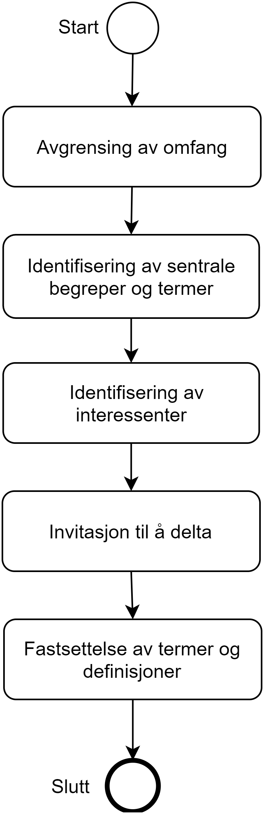

== Vedlegg C (informativt) - Forarbeid før denne standarden brukes [[vedlegg-c]]

Denne standarden handler om harmonisering og differensiering av begreper. Standarden forutsetter at omfanget er avgrenset, og at begrepene som skal harmoniseres eller differensieres, er definerte.

Dette informative vedlegget gir veiledning og tips til hvordan man avgrenser omfang og definerer begreper.

.Prosessmodell for forarbeid.

=== Avgrensing av omfang

==== Hvorfor
For at et arbeid med begrepskoordinering ikke skal bli for omfattende, er det viktig å avgrense det tydelig.

==== Forslag til fremgangsmåte

Arbeidet kan avgrenses ved å svare på spørsmålene under:

. Hva er formålet med arbeidet?
Eksempel: Skape felles, enhetlig rapportering og statistikk om studenttall i universitets- og høgskolesektoren.

. Hvilken informasjon skal begrepene beskrive?
Eksempel: Opplysningen skal beskrive/angi antall heltidsstudenter og antall deltidsstudenter på ulike studieprogram og på ulike studiesteder samt gjennomføringsgraden deres.

. Hvilken informasjon skal begrepene _ikke_ beskrive?
Eksempel: Opplysningene skal gi ikke gi svar på hvor mange studenter som mottar studielån, hvor mange som har søkt på et studium og hvor mange som har permisjon fra studiene.

. Finnes det tilgrensende fagområder som faller utenfor?
Eksempel: Andre, relevante fagområder er søknad og opptak, studiestøtte, studentmobilitet, men disse skal ikke omfattes i prosjektet.

. Suppler gjerne med egne spørsmål dersom det er relevant.

Svarene på disse spørsmålene vil muligens endre seg underveis, men vil uansett hjelpe til med å begrense omfanget av arbeidet. Dere kan gå tilbake til listen over spørsmålene og svarene. Når dere går gjennom de neste etappene, kan listen med spørsmål og svar gjennomgås på nytt.

==== Tips

Svarene kan dokumenteres ved hjelp av f.eks. et tekstdokument eller en informasjonsmodell.

=== Identifisering av sentrale begreper

==== Hvorfor
For å kunne identifisere begreper som skal harmoniseres eller differensieres.

==== Forslag til framgangsmåte

Arbeidet med å lage en liste over sentrale begreper kan ta utgangspunkt i avgrensningen i forrige trinn. Det kan gjøres ved å svare på noen spørsmål.

Eksempler på spørsmål kan være:

. *Hvem*: Hvilke roller er sentrale innenfor den aktuelle problemstillingen eller for formålet?
Eksempel på begreper: ‘student’, ‘vitenskapelig ansatt’, ‘foreleser’, ‘forsker’

. *Hva*: Hvilke "ting", hendelser, prosesser og situasjoner er viktige på fagområdet?
 	Eksempel på begreper: ‘studieprogram’, ‘studiespesialisering’, ‘studiepoeng’

. *Hvor*: Hvilke steder spiller en viktig rolle i fagområdet?
Eksempel på begreper: ‘studiested’, ‘universitetsområde’

. *Hvorfor*: Hva er bakenforliggende årsaker, hensikter eller ønsker til sentrale fenomener eller hendelser?
Eksempel på begreper: ‘kompetanse’, ‘kunnskap’, ‘livslang læring’

. *Når:* Hvilke typer tidsperioder eller tidspunkt er viktige?
Eksempel på begreper: ‘studiestart’, ‘studieår’, ‘høstsemester’, ‘vårsemester’, ‘semesterstart’, ‘semesterslutt’

Det er ikke sikkert at virksomhetene trenger begreper fra alle disse kategoriene, men det er nyttig å løfte dem fram og vurdere om de er betydningsfulle. Det kan også være nyttig å ha dem til observasjon for å vurdere senere om de bør inkluderes, mens arbeidet skrider fram. Spørsmålene kan besvares ved å bruke én eller flere av framgangsmåtene under:

* Skriftlige kilder:
** Lese dokumentasjon, regelverk, retningslinjer, standarder, støttemateriell ved saksbehandling, skjemaer osv.
** Lese dokumentasjon av tidligere arbeid med å løse tilsvarende problemstillinger (eldre løsningsbeskrivelser)
** Gjennomgå prosess- eller rutinebeskrivelser
* Muntlige kilder:
** Gjennomføre en form for systematisk idémyldring (_brainstorming_)
** Gjennomføre et strukturert intervju med fageksperter

Begrepene blir identifisert, kan settes opp som kandidater til harmonisering eller differensiering.

=== Identifisering av interessenter

==== Hvorfor
For å identifisere hvem som forvalter og bruker begrepene og hvem begrepene angår, slik at relevante interessenter blir involvert i eller informert om arbeidet.

==== Forslag til framgangsmåte

https://www.prosjektveiviseren.no/god-praksis/viktige-tema-i-alle-faser/interessenter[_Prosjektveiviseren]_ gir en god veiledning på interessentanalyse:

==== Tips
Det kan være en god idé å stille følgende spørsmål:

. Hvem skal begrepene deles med?
. Hvem (internt eller eksternt) er (potensielle) ansvarlige for de aktuelle begrepene?
. Hvilke andre enheter internt eller virksomheter benytter seg av de aktuelle begrepene?
. Bør sentrale aktører i privat sektor involveres, f.eks. bransjeorganisasjoner?

=== Invitasjon til å delta i prosjektarbeid

==== Hvorfor
For å sikre at riktige deltakere med riktig kompetanse er med i arbeidet, og at rollene er tydeliggjort.

==== Forslag til framgangsmåte
https://www.prosjektveiviseren.no/[_Prosjektveiviseren]_ gir en god veiledning om bl.a. prosjektorganisering.

De inviterte virksomhetene bør ta med seg en liste over de aktuelle begrepene som ønskes vurdert til prosjektet.

==== Tips
Når gruppa settes sammen, er det en god idé å ta hensyn til følgende:

* Roller:
** (potensielle) begrepsansvarlig(e)
** de viktigste interessentene
** sekretær/koordinator/prosjektleder for arbeidet
* Kompetanse:
** både generell og spesifikk fagkompetanse
** terminologisk kompetanse
** juridisk kompetanse

=== Fastsettelse av termer og definisjoner

==== Hvorfor
For å sikre at termer og definisjoner er beskrevet og dokumentert.

==== Forslag til framgangsmåte
Følg terminologiske metoder ved fastsetting av termer og definisjoner: analyser begrep - lag definisjon - fastsett term. Dersom flere virksomheter er involvert, bør de først gjøre dette hver for seg.

==== Tips
https://www.sprakradet.no/Sprakarbeid/Terminologi/[Språkrådets nettsider] gir mer informasjon om terminologi.

https://www.difi.no/referansekatalogen/begrepsanalyse-og-definisjonsarbeid[_Referansekatalogen]_ inneholder relevante standarder for begrepsanalyse og definisjonsarbeid, inkl. _Termlosen_.

Begrepene kan dokumenteres ved hjelp av f.eks. et tekstdokument, regneark, informasjonsmodell eller en begrepsmodell.
